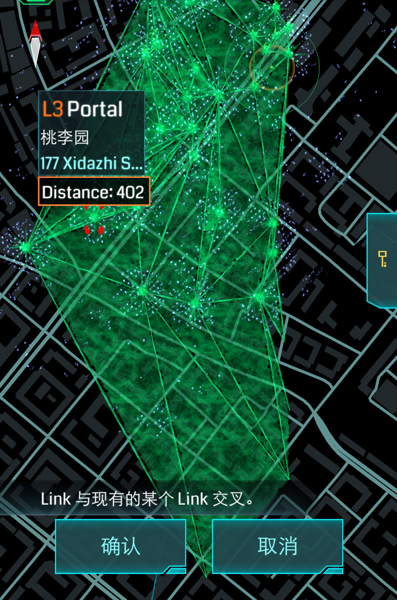

## Meet Ingress

之前已多次听说Ingress这个游戏，然而由于墙和懒，一直没有去尝试。
上周五想试试Google I/O上发布的Inbox，没有在中国区的App Store找到，却发现了Ingress，抱着试试看的心态下载了下来。
这个游戏分两个阵营，“Enlightened”和“Resistance”，我看介绍选择了E军（不过我更喜欢R军的颜色>_<）。
Ingress的画面比较有科技感，这里引用一句官方的话吧：“The world around you is not what it seems”。然而游戏的3D建模确实简陋，尤其物品建模远差于同期游戏（这个游戏是2012年末出的，测试了一年到2013年末终于公测）。这很可能是为AR设备做准备（目前AR设备计算能力较弱），想想看这种游戏如果在Google Glass上玩一定很爽，手机确实不是它最适合的载体。
上周六随便Hack了几个Portal，凭感觉熟悉游戏，顺利到了第二级。
上周日和同学一起去打掉并占领了几个Portal，并连成Link，顺利到了第三级。
周一（昨天）早上出去Hack了一圈，炸了几个好炸的并占领，连了一些Control Field，到了第四级。当天下午、晚上又活动了一会，升到第五级。
今天早上又把工大北面和南面的Po各连成一片，然而由于敌军的Po“学友书店”等级高Link多，南北被隔开。匆忙完工后去参加体育考试，还是挺顺利的。
中午开始下雨，又开始打雷，我先午休了一会，等雨不大了打算打伞出去玩一会。于是一下午都赔进去了，成果是加强了北面和南面的连接。然后就去吃了饭。
终于在我打算收工的时候，qsnake菊苣炸掉了“学友书店”！我想这是个好机会，打算把整个工大都用E军的Po围起来。不过手机没电了_(:з」∠)_。去寝室取了移动电源继续Link。
到了将近九点的时候，终于只差从游泳馆到理学楼雕塑的Link了。

正当我走向游泳馆时，我发现之前有几个Po被敌军炸掉了...
...这是要逼死强迫症啊！
于是我连完了剩下的Link后，打算回去补...

又得跑回上面去连...

还差最后几个...

终于完工！现在已经是晚上十点多。

在Intel Map上看起来是这样的

我想我一天升一级的记录就到此为止了...

唯一的感受就是...好累！